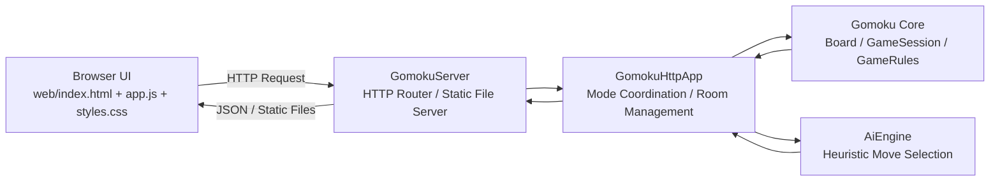
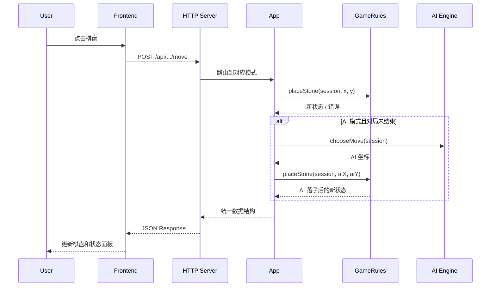

<div align="center">

# finalwork

### A Full-Stack Gomoku Project Built with Cangjie

一个基于仓颉语言实现的完整五子棋项目，覆盖规则引擎、启发式 AI、HTTP 服务、房间联机和单页前端界面。  
它不是“只有算法”或者“只有页面”的演示代码，而是一个前后端闭环的可运行应用。

<p>
  <a href="#项目概览">项目概览</a> |
  <a href="#快速开始">快速开始</a> |
  <a href="#系统架构">系统架构</a> |
  <a href="#api-概览">API 概览</a> |
  <a href="#开发说明">开发说明</a>
</p>

</div>

---

## 项目概览

`finalwork` 是一个课程项目形态下的完整应用，而不是模板仓库。项目以仓颉为核心语言，实现了：

- 可直接运行的 **HTTP 服务端**
- 可直接访问的 **浏览器前端**
- 独立的 **五子棋规则与状态管理**
- 内置的 **启发式 AI 对手**
- 支持双人连接的 **局域网房间模式**
- 可执行的 **单元测试**

这个项目的核心设计原则很明确：

- **后端作为唯一真实状态源**：棋盘、回合、胜负与合法性判断全部由后端控制
- **前端只负责交互与可视化**：页面不自行决定结果，所有状态以后端返回为准
- **规则、AI、HTTP、页面资源分层清晰**：便于后续扩展和维护

## 项目亮点

| 能力 | 说明 |
| --- | --- |
| Domain-Driven 规则层 | 棋子、棋盘、对局状态、落子结果都有清晰建模 |
| 后端权威状态 | 所有模式统一复用规则层，避免前后端状态漂移 |
| 单机 + AI + LAN 三模式 | 一套前端，三类玩法 |
| 启发式 AI | 能处理直接制胜、威胁阻断和基础棋型评估 |
| 轻量 HTTP 服务 | 不依赖外部 Web 框架，直接完成静态资源与 API 分发 |
| 工程化基础完整 | 有构建、有测试、有目录分层、有接口约定 |

## 功能矩阵

| 模式 | 描述 | 适用场景 |
| --- | --- | --- |
| 本地双人 | 两名玩家在同一设备交替落子 | 演示规则与基础交互 |
| 人机对战 | 玩家落子后后端立即计算 AI 响应 | 展示规则层与 AI 协作 |
| 局域网对战 | 主机创建房间，另一名玩家通过 `roomId` 加入 | 展示房间状态与联机同步 |

## 界面说明

前端位于 `web/` 目录，整体是一页式控制台界面，包含以下区域：

- **Hero 区域**：展示服务状态与项目入口信息
- **棋盘区域**：15 x 15 网格棋盘，支持点击落子与状态反馈
- **模式切换区域**：本地双人 / 人机 / 局域网
- **状态面板**：当前玩家、对局结果、最后一步、连接状态等
- **房间面板**：创建房间、输入 `roomId` 加入、显示房间状态

默认运行地址：

```text
http://127.0.0.1:8080
```

## 适合拿来做什么

- 课程作业或课程设计展示
- 仓颉后端项目结构参考
- 小型博弈项目的规则层设计参考
- 前后端分离边界的轻量示例
- 后续继续扩展成悔棋、复盘、排行榜、搜索型 AI 的基础工程

---

## 技术栈

| 层级 | 技术 |
| --- | --- |
| 编程语言 | Cangjie |
| 构建工具 | `cjpm` |
| 网络与文件 | `std.net`、`std.fs` |
| 容器与集合 | `std.collection` |
| 测试框架 | `std.unittest` |
| 前端 | HTML + CSS + Vanilla JavaScript |

根据当前 [`cjpm.toml`](/Users/danny/XJTU/compute/final/finalwork/cjpm.toml)，项目配置为：

```toml
[package]
  cjc-version = "1.0.5"
  name = "finalwork"
  version = "1.0.0"
  output-type = "executable"
```

---

## 快速开始

### 环境要求

开始前请确认本机已安装可用的仓颉工具链，并且 `cjpm` 可以直接使用：

```bash
cjpm --version
```

### 1. 检查项目

```bash
cjpm check
```

### 2. 构建项目

```bash
cjpm build
```

### 3. 启动服务

```bash
cjpm run
```

服务启动后可在浏览器访问：

```text
http://127.0.0.1:8080
```

### 4. 运行测试

```bash
cjpm test
```

### 5. 清理构建产物

```bash
cjpm clean
```

## 常用命令

| 命令 | 用途 |
| --- | --- |
| `cjpm check` | 检查依赖与包配置 |
| `cjpm build` | 编译项目 |
| `cjpm run` | 构建并启动服务 |
| `cjpm test` | 运行单元测试 |
| `cjpm clean` | 清理构建缓存与产物 |

## 已验证状态

当前仓库快照下，以下命令已实际执行并通过：

```bash
cjpm build
cjpm test
```

测试结果为：

- 共 `8` 个用例
- `8` 个通过
- `0` 个失败

---

## 系统架构



### 分层职责

#### 1. 展示层

前端负责：

- 渲染棋盘与状态
- 响应用户点击
- 调用后端接口
- 在局域网模式下轮询房间状态

前端不负责：

- 判定坐标是否合法
- 判断是否轮到当前玩家
- 判断胜负
- 推导最终棋盘状态

#### 2. 应用层

`GomokuHttpApp` 负责：

- 管理本地对局与 AI 对局实例
- 管理房间创建、加入、重开
- 调用规则层落子
- 在 AI 模式下衔接玩家落子与 AI 落子

#### 3. 领域层

`gomoku_core.cj` 负责：

- 棋盘状态
- 当前回合方
- 落子历史
- 五连判定
- 平局判定
- 对局结束后的拒绝落子逻辑

#### 4. 策略层

`gomoku_ai.cj` 负责：

- 候选点筛选
- 棋型评分
- 进攻与防守权衡
- 在不同难度下选择最佳落点

## 运行流程



---

## 代码结构

```text
finalwork/
├── AGENTS.md
├── cjpm.toml
├── cjpm.lock
├── src/
│   ├── main.cj
│   ├── gomoku_core.cj
│   ├── gomoku_ai.cj
│   ├── gomoku_http.cj
│   ├── gomoku_core_test.cj
│   └── gomoku_ai_test.cj
├── web/
│   ├── index.html
│   ├── styles.css
│   └── app.js
└── README.md
```

## 模块说明

### [`src/main.cj`](/Users/danny/XJTU/compute/final/finalwork/src/main.cj)

程序入口。创建 `GomokuHttpApp` 并在 `0.0.0.0:8080` 启动 HTTP 服务。

### [`src/gomoku_core.cj`](/Users/danny/XJTU/compute/final/finalwork/src/gomoku_core.cj)

核心规则模块，定义：

- `Stone`
- `GameResult`
- `Move`
- `PlaceMoveResult`
- `Board`
- `GameSession`
- `GameRules`

这是项目最核心的领域层，也是所有玩法模式复用的基础。

### [`src/gomoku_ai.cj`](/Users/danny/XJTU/compute/final/finalwork/src/gomoku_ai.cj)

AI 模块，负责根据当前棋盘选择合理落点。项目中已定义：

- `Point`
- `AiDifficulty`
- `PatternSummary`
- `AiEngine`

默认对局流程会调用 `AiEngine.chooseMove(session)` 进行选点。

### [`src/gomoku_http.cj`](/Users/danny/XJTU/compute/final/finalwork/src/gomoku_http.cj)

服务端接口层，负责：

- 解析 HTTP 请求
- 路由到对应业务入口
- 统一返回 JSON 响应
- 分发 `web/` 静态文件
- 管理 LAN 房间状态

### [`web/index.html`](/Users/danny/XJTU/compute/final/finalwork/web/index.html)

页面骨架，定义布局和核心 DOM 区域。

### [`web/styles.css`](/Users/danny/XJTU/compute/final/finalwork/web/styles.css)

页面视觉样式，包含棋盘、按钮、布局、响应式和整体配色风格。

### [`web/app.js`](/Users/danny/XJTU/compute/final/finalwork/web/app.js)

前端逻辑层，负责：

- 全局状态管理
- 请求封装
- 棋盘渲染
- 模式切换
- 房间轮询
- 错误与提示信息处理

---

## 数据模型

### 棋盘编码

后端返回的棋盘是一个 `15 x 15` 的二维数组，编码规则如下：

| 值 | 含义 |
| --- | --- |
| `0` | 空位 |
| `1` | 黑子 |
| `2` | 白子 |

### 对局状态字段

普通模式返回结构包含这些核心字段：

| 字段 | 说明 |
| --- | --- |
| `mode` | 当前模式，如 `local`、`ai` |
| `board` | 二维棋盘数组 |
| `currentPlayer` | 当前应落子方，`Black` 或 `White` |
| `gameResult` | `Playing` / `BlackWin` / `WhiteWin` / `Draw` |
| `finished` | 是否已结束 |
| `lastMove` | 最近一步 |
| `playerMove` | 玩家本次操作对应的落子 |
| `aiMove` | AI 在本次请求中的落子 |

局域网模式会额外包含：

| 字段 | 说明 |
| --- | --- |
| `roomId` | 房间号 |
| `playerToken` | 玩家凭证 |
| `playerRole` | `host` 或 `guest` |
| `playerStone` | 当前玩家对应棋色 |
| `connectedPlayers` | 已连接玩家数 |
| `connectionStatus` | `Waiting` 或 `Connected` |
| `canMove` | 当前客户端是否可落子 |
| `waitingForOpponent` | 是否仍在等待对手 |

---

## API 概览

### 响应格式

所有 API 统一返回如下外层结构：

```json
{
  "code": 0,
  "message": "ok",
  "data": {}
}
```

说明：

- `code = 0` 表示业务成功
- 非零 `code` 表示业务错误
- HTTP 状态码与 `code` 会一起表达错误语义

### 接口列表

| Method | Path | 描述 |
| --- | --- | --- |
| `GET` | `/api/health` | 服务健康检查 |
| `POST` | `/api/local/start` | 创建本地双人新对局 |
| `POST` | `/api/local/move` | 本地双人模式落子 |
| `POST` | `/api/ai/start` | 创建人机模式新对局 |
| `POST` | `/api/ai/move` | 玩家落子并触发 AI 响应 |
| `POST` | `/api/room/create` | 创建局域网房间 |
| `POST` | `/api/room/join` | 加入局域网房间 |
| `POST` | `/api/room/state` | 查询房间状态 |
| `POST` | `/api/room/move` | 局域网模式落子 |
| `POST` | `/api/room/restart` | 重开房间对局 |

### 示例 1：健康检查

请求：

```http
GET /api/health
```

响应：

```json
{
  "code": 0,
  "message": "ok",
  "data": {
    "status": "ok"
  }
}
```

### 示例 2：启动本地双人模式

请求：

```http
POST /api/local/start
Content-Type: application/json

{}
```

响应示意：

```json
{
  "code": 0,
  "message": "ok",
  "data": {
    "mode": "local",
    "board": [[0, 0, 0]],
    "currentPlayer": "Black",
    "gameResult": "Playing",
    "finished": false,
    "lastMove": null,
    "playerMove": null,
    "aiMove": null
  }
}
```

说明：

- 文档中 `board` 为缩略示意，真实返回为 `15 x 15`

### 示例 3：人机模式落子

请求：

```http
POST /api/ai/move
Content-Type: application/json

{
  "x": 7,
  "y": 7
}
```

成功后响应中可能同时出现：

- `playerMove`
- `aiMove`
- `lastMove`

其中 `lastMove` 会是本次请求后棋盘上的最后一步；如果 AI 成功落子，通常等于 `aiMove`。

### 示例 4：创建局域网房间

请求：

```http
POST /api/room/create
Content-Type: application/json

{}
```

响应示意：

```json
{
  "code": 0,
  "message": "ok",
  "data": {
    "mode": "lan",
    "roomId": "100001",
    "playerToken": "player-1",
    "playerRole": "host",
    "playerStone": "Black",
    "connectedPlayers": 1,
    "connectionStatus": "Waiting",
    "canMove": false,
    "waitingForOpponent": true
  }
}
```

### 业务错误语义

目前实现中常见错误包括：

| HTTP Status | Code | 说明 |
| --- | --- | --- |
| `400` | `2001` | 坐标非法、位置已被占用、对局已结束等落子错误 |
| `404` | `1001` | 本地或 AI 对局尚未启动 |
| `404` | `4001` | 房间不存在 |
| `409` | `4002` | 房间已满 |
| `409` | `4003` | 房间仍在等待对手 |
| `409` | `4004` | 当前不是你的回合 |
| `403` | `4005` | 玩家凭证无效 |
| `405` | `1003` | HTTP Method 不允许 |
| `500` | `3001` / `3002` | AI 执行失败 |

---

## 使用方式

### 本地双人

1. 打开页面，选择“本地双人”
2. 点击“重新开始”或直接开始新局
3. 两名玩家轮流点击棋盘落子
4. 页面状态区实时显示当前回合与胜负状态

### 人机对战

1. 切换到“人机”
2. 玩家点击棋盘提交坐标
3. 后端先校验玩家落子，再触发 AI 选点
4. 前端拿到完整新状态后统一刷新页面

### 局域网对战

1. 玩家 A 创建房间
2. 系统返回 `roomId` 与 `playerToken`
3. 玩家 B 输入 `roomId` 加入
4. 双方页面通过轮询接口同步房间状态
5. 房间连接完成后，黑方先手，双方轮流落子

---

## 测试说明

当前测试文件包括：

- [`src/gomoku_core_test.cj`](/Users/danny/XJTU/compute/final/finalwork/src/gomoku_core_test.cj)
- [`src/gomoku_ai_test.cj`](/Users/danny/XJTU/compute/final/finalwork/src/gomoku_ai_test.cj)

### 规则层覆盖

- 首次落子合法性
- 非法坐标拒绝
- 重复落子拒绝
- 横向五连胜利判定
- 对局结束后继续落子应被拒绝

### AI 层覆盖

- 评分逻辑偏好立即获胜点
- 简单难度选择直接制胜点
- 普通难度优先阻断对手必胜点

### 运行测试

```bash
cjpm test
```

---

## 开发说明

### 代码风格

项目当前遵循这些约定：

- 4 空格缩进
- 类型名使用 PascalCase
- 函数与变量使用 lowerCamelCase
- 包名使用小写
- 小函数、单一职责、少魔法数字

### 推荐开发流程

1. 在 `src/` 中先修改规则或接口
2. 若功能涉及行为变化，先补测试或同步更新测试
3. 执行 `cjpm build`
4. 执行 `cjpm test`
5. 再手动运行 `cjpm run` 进行页面联调

### 适合优先扩展的方向

- 悔棋与复盘
- AI 难度分级
- Minimax / Alpha-Beta 搜索
- 联机房间超时与销毁机制
- 更完整的前端状态提示
- 棋谱导出与导入

---

## 设计取舍

这个项目有几个明显的工程取舍：

- **没有引入重型 Web 框架**：目标是突出仓颉基础能力与项目可读性
- **前端保持轻量**：避免把规则逻辑复制到浏览器端
- **房间状态保存在进程内存中**：适合课程项目和单机演示，暂不追求分布式持久化
- **AI 采用启发式而非搜索树深度博弈**：实现成本更低、可读性更高，也更适合作业展示

这些取舍让项目更适合教学、展示和二次扩展，而不是直接面向生产环境。

---

## Roadmap

- [ ] 增加悔棋接口与前端按钮
- [ ] 增加棋谱记录与导出
- [ ] 增加 AI 难度配置入口
- [ ] 引入更强的搜索式 AI
- [ ] 改进房间生命周期管理
- [ ] 增加对局结束后的复盘展示

---

## License

当前仓库尚未声明许可证。  
如果后续要公开发布，建议新增 `LICENSE` 文件，并在 README 中明确授权方式。
